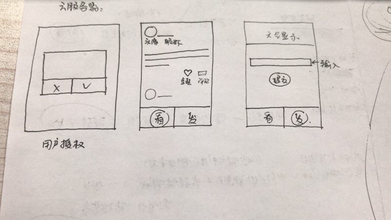

1.2 基础知识 -- 后端
===

# 1.2.1 为什么要学习后端

后端作为当下的互联网环境中扮演着不可或缺的地位，比如你现在正在浏览的“火花空间”中的文章，就是在你向后端发出请求之后，后端经过一定的处理返回给浏览器才能展示到你的面前。如果没有了后端，你就可以看到一个熟悉的404 Not Found错误。

当前一个常见的前后端分离的网站由以下三个部分组成：

- **前端** 用户操作的界面，常见的前端有：浏览器，微信小程序等等。他们包含了用户能够看到所有东西，表单、按钮、图片、文字以及动画。前端页面通常使用HTML、CSS、JS以及他们的变体进行编写。
- **后端** 用以处理无法在、或者不方便在前端进行的操作，通常是文件的存储，用户权限校验，信息和数据的存储等等。后端程序则以使用大部分流行的语言进行编写，基本没有什么限制，为了降低学习语言的数量，我们可以选择使用JS进行后台的编写。
- **数据库** 大量的数据要按照一定的结构存放在数据库中，方便后端在需要的时候进行调用。常见的数据库有：Mysql，MongoDB，SQL server。在本次教程中，我们采用和JS关系最为密切的MongoDB作为我们的数据库。

可见，我们所需要编写的后端是一个承上启下的存在，需要将前端请求的数据从数据库中查找出来，翻译成前端需要的格式并返回，或是将前端提交的数据按照编写程序时对于数据库的格式存储到数据库中。最简单的一个登录和注销的操作就需要用到后端查询用户输入的密码是否正确，因为我们不可能将所有用户的密码都明文存储在前端，这样太危险了。

# 1.2.2 留言板原形展示+功能描述

在本次实验的进阶部分，我们要发布一个完整可用的微信小程序。原型如下图，它包括几个功能：

- **登录** 调用微信提供的登录接口进行登录，并获得用户的头像和昵称，用作留言板的显示。
- **查看留言** 调用后端提供的接口，我们可以按照时间顺序，看到所有使用这个小程序的人发表的留言。
- **喜欢** 对于你觉得有兴趣的留言，你可以点击“喜欢”按钮，为你喜欢的留言点赞。
- **评论** 对你深受启发的留言，你可以在这条留言下面评论，或者查看别人的留言。
- **发表** 如果你也想上留言版，你也可以自己发布留言。

<!-- TODO: 这里需要更换成最终的效果图 -->

# 1.2.3 小节总结+测试

本节介绍了表单的概念和用途，并描述了一个前后端开发的答题思路。在第2章开发实战的进阶部分，我们将实际上手，体验开发这个小程序。

完成本节学习的同学，请认真完成本节测试。完成答题后，可查看答案解析，仍有疑惑可点击右边👉悬浮框中的“提问”，及时询问教师和助教。
