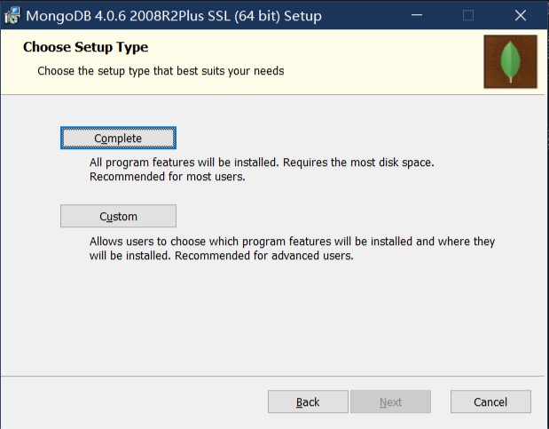
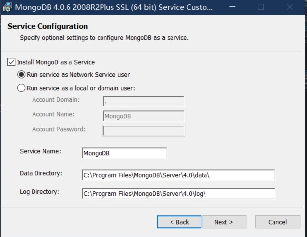

# MongoDB 基础

## 什么是MongoDB

MongoDB是一个跨平台，面向文档的数据库，提供高性能，高可用性和易于扩展。MongoDB是工作在集合和文档上一种概念。

- 数据库
    数据库是一个集合的物理容器。每个数据库获取其自己设定在文件系统上的文件。一个单一的MongoDB服务器通常有多个数据库。
- 集合
    结合是一组MongoDB文件，存在于MongoDB数据库中。集合中的文档可以有不同的字段，通常情况下，一个集合中的所有文档都是类似的或者相关的。
- 文档
    文档是一组键值对。文档具有“动态模式”。所谓动态模式，在同一个集合的文档不必具有统一的结构，不同文档同一个键名的键值可以使用不同的数据类型。

实例文档：

下面就展示了一个留言的文档，仅仅是一个逗号分隔的键值对的文档结构，非常类似于JS的对象，二至之间的区别在于前者不能使用函数作为其成员。

    {
        _id: ObjectId(7df78ad8902c)
        title: 'MongoDB Overview', 
        description: 'MongoDB is no sql database',
        by: 'yiibai tutorial',
        url: 'http://www.yiibai.com',
        tags: ['mongodb', 'database', 'NoSQL'],
        likes: 100, 
        comments: [	
            {
                user:'user1',
                message: 'My first comment',
                dateCreated: new Date(2011,1,20,2,15),
                like: 0 
            },
            {
                user:'user2',
                message: 'My second comments',
                dateCreated: new Date(2011,1,25,7,45),
                like: 5
            }
        ]
    }

<!-- TODO: 这里的文档结构需要替换 -->

## 如何安装

<!-- TODO: 这里应该有一个安装MongoDB的链接 -->

<!-- ##### 在 Windows 上安装 MongoBD

我们要在Windows上安装MongoDB，首先从 [https://www.mongodb.com/download-center/community](https://www.mongodb.com/download-center/community) 下载最新版本的MongoDB，下载完成后的文件应该是`mongodb-win32-x86_64-2008plus-ssl-[version]-signed.msi`，这里的[version]是你下载的MongoDB的版本。

双击运行之后下一步，同意使用协议后下一步。

我们推荐使用完整模式(Complete)进行安装，因为这样可以免去一些配置的过程，当然你也可以选择自定义(Custom)模式进行安装，那么你就需要在今后的实验中注意自己数据库启动与否的问题。

#### 完整模式

保持这个默认的设置不要动，直接下一步即可完成安装。

打开`cmd`，七日换到

我们推荐将MongoDB安装在 -->
