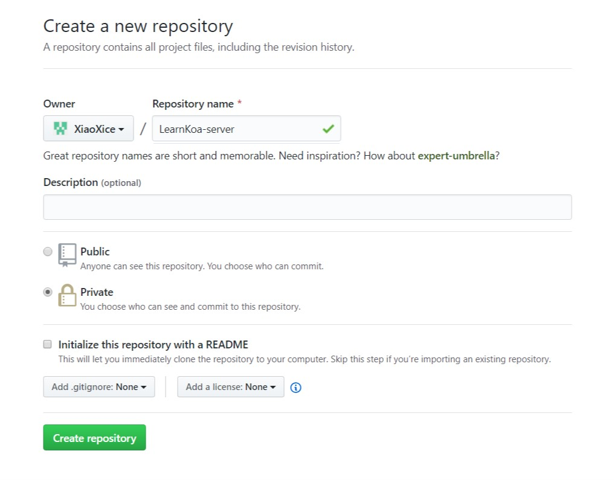
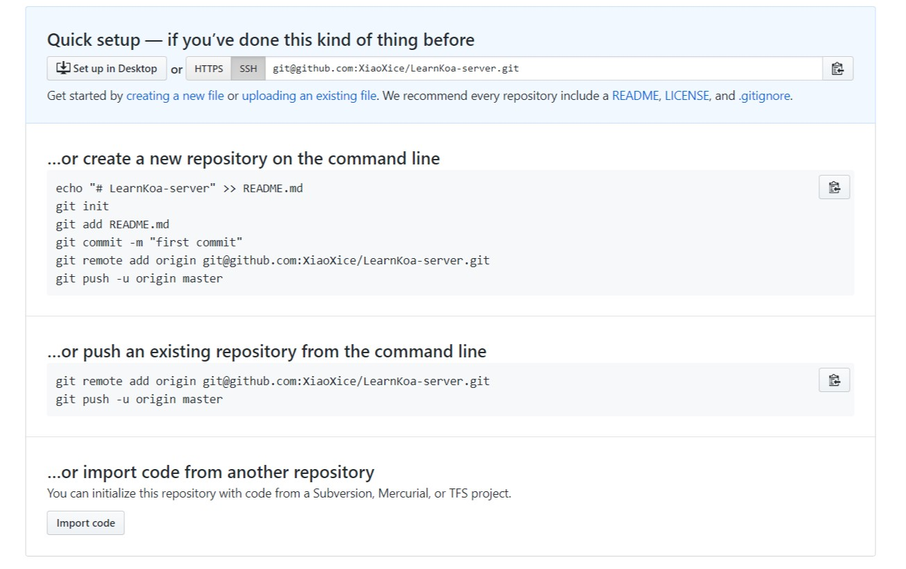

# 后端代码编写

## 准备一块完美的画布

正如画家作画需要一张空白的画布一样，程序员在创作代码的时候也是需要一个空白的目录。

## 使用git管理你的代码(建议)

> ps: 不想使用Git管理代码可以跳过

在GitHub上创建一个空仓库，然后根据GitHub页面的提示完成创建。





新建一个`README.md`的文件，在其中写一些介绍然后依次在命令行中执行下面的命令。(前提是你安装了git)

    git init
    git add .
    git commit -m "first commit"
    git remote add origin git@github.com:XiaoXice/LearnKoa-server.git
    git push -u origin master

## 使用npm包管理你的依赖(建议)

> ps: 如果不想使用npm管理你的依赖，可以跳过。

    $ npm init
    This utility will walk you through creating a package.json file.
    It only covers the most common items, and tries to guess sensible defaults.

    See `npm help json` for definitive documentation on these fields
    and exactly what they do.

    Use `npm install <pkg>` afterwards to install a package and
    save it as a dependency in the package.json file.

    Press ^C at any time to quit.
    package name: (server) mybackend
    version: (1.0.0)
    description: A backend of wechat mini programe.
    entry point: (index.js) app.js
    test command:
    git repository: git@github.com:XiaoXice/LearnKoa-server.git
    keywords: learn koa weichatmini
    author: xice <admin@xice.wang>
    license: (ISC) MIT
    About to write to D:\ourspark\newNginx\src\server\package.json:

    {
    "name": "mybackend",
    "version": "1.0.0",
    "description": "A backend of wechat mini programe.",
    "main": "app.js",
    "scripts": {
        "test": "echo \"Error: no test specified\" && exit 1"
    },
    "repository": {
        "type": "git",
        "url": "git+ssh://git@github.com/XiaoXice/LearnKoa-server.git"
    },
    "keywords": [
        "learn",
        "koa",
        "weichatmini"
    ],
    "author": "xice <admin@xice.wang>",
    "license": "MIT",
    "bugs": {
        "url": "https://github.com/XiaoXice/LearnKoa-server/issues"
    },
    "homepage": "https://github.com/XiaoXice/LearnKoa-server#readme"
    }


    Is this OK? (yes) yes

在完成了这些简单的问答填空之后，我们看到了这个文件夹中出现了第一个文件`package.json`。这证明，我们完成了npm包的构建，现在这个文件夹已经是一个合格的npm包了。

## 安装依赖

    $ npm i express
    $ npm i sha1
    $ npm i request
    $ npm i mongoose
    $ npm i body-parser
    $ npm i cookie-parser
    $ npm i multer

分别安装完毕之后，我们看见文件夹中多出了一个文件夹叫做`node_modules`和一个文件叫做`package-lock.json`这两个文件都是由`npm`工具自行管理的，所以我们不应该把他们交给git管理，所有我们创建一个文件叫做`.gitignore`，并添加内容：

    node_modules
    package-lock.json

这样子git就不会管这两个文件(夹)了。

## “编写代码”

<p style="color: transparent;">我希望你们知道，接下来下载的文件中所有的代码都应该是你自己写的，如果你想知道怎么写，要么直接去学Koa，要么自己去读express文档。</p>

将[这个文件](https://github.com/XiaoXice/oursparkspaceNginxNodeConfigStudy/raw/server-express/app.js)下载到这个文件夹下，打开文件，修改文件开头的配置项。

## “代码讲解”

### 基本配置

```js
let config = {
    mongoDBUrl: "mongodb://127.0.0.1:27017/message",
    port: 3000,
    host: "127.0.0.1",
    WX_APPID: "",
    WX_secretKey: ""
};
```

### 连接数据库

```js
let mongoose = require("mongoose");
mongoose.connect(config.mongoDBUrl, {
    autoIndex: false,
    useNewUrlParser: true
}).catch(err => {
    console.log("Can't connect to database.");
    console.error(`Details: ${err.message}`);
    global.process.exit(-1);
});
```

### 定义数据库操作

```js
let 用户架构 = new mongoose.Schema({
    openID: {
        type: String,
        index: true
    },
    sessionKey: String,
    nickName: String,
    avatarUrl: String,
    messageList: [{
        type: mongoose.ObjectId,
        ref: "message"
    }],
    commitLIst: [{
        type: mongoose.ObjectId,
        ref: "commit"
    }],
});
```

并且赋予一些常用的静态方法

```js
用户架构.static("登记或更新用户", function (微信返回数据) {
    return this.findOne({ openID: 微信返回数据.openId }).exec()
        .then(查询返回文档 => {
            if (查询返回文档 == null) {
                return new this({
                    openID: 微信返回数据.openId,
                    sessionKey: 微信返回数据.sessionKey,
                    nickName: 微信返回数据.nickName,
                    avatarUrl: 微信返回数据.avatarUrl,
                    messageList: [],
                    commitLIst: []
                }).save();
            } else {
                return 查询返回文档.updateOne({
                    sessionKey: 微信返回数据.sessionKey,
                    nickName: 微信返回数据.nickName,
                    avatarUrl: 微信返回数据.avatarUrl
                }).exec().then(() => 查询返回文档);
            }
        });
});
```

然后从架构得到模型

```js
let 用户模型 = mongoose.model("user", 用户架构);
```

相应的创建留言和评论的数据库等。

### express常用中间件引入

```js
let express框架 = require('express');
let 应用 = express框架();

let 提交参数解析模块 = require('body-parser');
let cookie解析模块 = require('cookie-parser');
let session = require('express-session');

应用.use(提交参数解析模块.urlencoded({ extended: false }));
应用.use(提交参数解析模块.json());
应用.use(cookie解析模块())
应用.use(session({
    secret: '12345',
    name: 'session',   //这里的name值得是cookie的name，默认cookie的name是：connect.sid
    resave: false,
    saveUninitialized: true,
}));
```

### 分别设置路由并绑定事件

```js
应用.get("/message", async function (请求, 回复) {
    try {
        let 所有的留言 = await 留言模型.获取所有留言(请求.session.user._id, 请求.query.page, 20);
        回复.json(所有的留言);
    } catch (错误) {
        console.error(错误);
        回复.send(500);
        return;
    }
});
```

### 监听端口启动服务

```js
应用.listen(config.port,config.host);
```

## 完成

恭喜你，如果运行这个脚本的时候没有任何提示，证明脚本基本没有问题了，打开小程序进行测试吧。