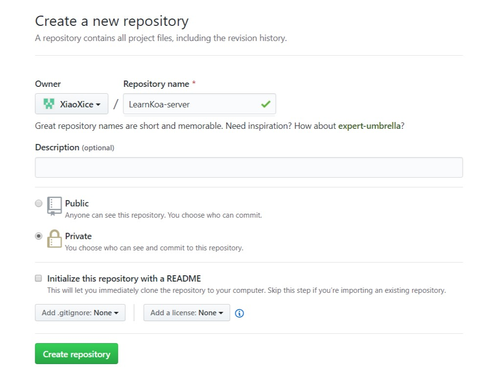
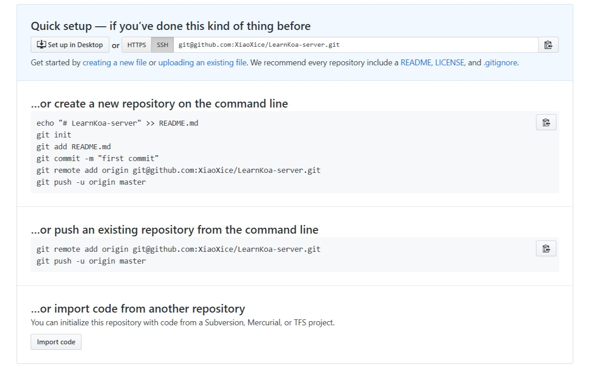

# Koa 抬手式

经过了Koa项目的实战，以及各位自己的探索，相信已经了解到了Koa并没有提供很多常用的功能，甚至他都不能解析客户端提交的POST请求之中的信息，也没有路由模块。那么，这一节我们就先来学习Koa项目的抬手式。

## 找到一个空白的路径

艺术家创作的时候需要一个洁白的画布，这样子才能更好的展现自己的才华，程序员写项目也是一样的，我们需要一个干净的目录，这样子我们才能发挥自己的创造力。

首先，这个路径是绝对干净的，不是之前各种项目的子路径，因为有些工具会向父级目录搜索相关的配置文件，这通常会产生不利的影响。

之后这个文件夹也要是空的，最好什么文件都不能存在。

最后，这个文件夹，你是拥有完全的权限的，如果你在这个文件夹下的各种操作都会问你要管理员权限，那么除非你真的具有管理员的知识水平，否则最好换一个目录。

## 创建一个子目录作为我们后端程序的Workspace

作为一个前后端分离的应用，那么前后端的代码也应该是分离的，连接他们的只有事先规定好的协议。

当然我们可以通过git工具来完成，这样子我们就可以顺手完成git仓库的建立。

    git init server

在这个空白的画布上，这行代码会创建一个叫做server的文件夹，并且将它初始化成为一个空白的git仓库，这个操作就像水墨画中，作画之前需要用水将画布阴湿，是编写代码的第0步。

让我们切换到这个server目录之下，在这里创建我们的后端程序。

## 创建一个npm包

作为一个NodeJs程序，很自然的使用npm来管理你的依赖，当然就需要将自己写的程序也初始化成为一个软件包。

当然最好在Github上开一个远程仓库来解决你的代码的备份问题，现在的github已经解除了私有仓库，何乐而不为呢？





    $ npm init
    This utility will walk you through creating a package.json file.
    It only covers the most common items, and tries to guess sensible defaults.

    See `npm help json` for definitive documentation on these fields
    and exactly what they do.

    Use `npm install <pkg>` afterwards to install a package and
    save it as a dependency in the package.json file.

    Press ^C at any time to quit.
    package name: (server) mybackend
    version: (1.0.0)
    description: A backend of wechat mini programe.
    entry point: (index.js) app.js
    test command:
    git repository: git@github.com:XiaoXice/LearnKoa-server.git
    keywords: learn koa weichatmini
    author: xice <admin@xice.wang>
    license: (ISC) MIT
    About to write to D:\ourspark\newNginx\src\server\package.json:

    {
    "name": "mybackend",
    "version": "1.0.0",
    "description": "A backend of wechat mini programe.",
    "main": "app.js",
    "scripts": {
        "test": "echo \"Error: no test specified\" && exit 1"
    },
    "repository": {
        "type": "git",
        "url": "git+ssh://git@github.com/XiaoXice/LearnKoa-server.git"
    },
    "keywords": [
        "learn",
        "koa",
        "weichatmini"
    ],
    "author": "xice <admin@xice.wang>",
    "license": "MIT",
    "bugs": {
        "url": "https://github.com/XiaoXice/LearnKoa-server/issues"
    },
    "homepage": "https://github.com/XiaoXice/LearnKoa-server#readme"
    }


    Is this OK? (yes) yes

在完成了这些简单的问答填空之后，我们看到了这个文件夹中出现了第一个文件`package.json`。这证明，我们完成了npm包的构建，现在这个文件夹已经是一个合格的由git管理的npm包了。

## 安装依赖

    $ npm i koa
    $ npm i sha1
    $ npm i request
    $ npm i mongoose
    $ npm i koa-body
    $ npm i koa2-cors
    $ npm i koa-logger
    $ npm i koa-router
    $ npm i koa-session2

分别安装完毕之后，我们看见文件夹中多出了一个文件夹叫做`node_modules`和一个文件叫做`package-lock.json`这两个文件都是由`npm`工具自行管理的，所以我们不应该把他们交给git管理，所有我们创建一个文件叫做`.gitignore`，并添加内容：

    node_modules
    package-lock.json

这样子git就不会管这两个文件(夹)了。

## 构建大体框架

首先就是整个程序的入口`app.js`。

``` js
// app.js
const Koa = require("koa");
let bodyParser = require('koa-body');
const session = require("koa-session2");
let logger = require("koa-logger");
const app = new Koa();
app.use(session({key: "session"}));
app.use(bodyParser({
    multipart: true,
    formLimit: "1.5mb"
}));
if (app.env == "development") {
    let cors = require("koa2-cors");
    app.use(cors({ credentials: true }));
    app.use(logger());
    app.use((ctx, next) => {
        if (ctx.request.method == "POST") 
            console.log(ctx.request.body);
        return next();
    })
};
app.listen(3000);
```

不同Koa中间件的使用方式请自行查阅对应的文档。不过各家模块的名字应该都挺直白的，即便不知道怎么使用，望文生义应该也知道这个中间件是干什么用的。

按照惯例，路由文件和具体的业务逻辑应该分别单独放在一个文件夹中，因此我们创建如下目录结构

    server/
        - controller/
            index.js*
        - router/
            index.js*
        app.js

```js
// router/index.js
let Router = require("koa-router");
let route = new Router();
let controller = require("../controller");

route.get("/", controller.index);

module.exports = route;
```

```js
// controller/index.js
let index = async(ctx, next) => {
    console.log(ctx);
    ctx.response.status = 406;
    ctx.response.body = "there's nothing, go back";
    return next();
}

module.exports = {
    index
}
```

```js
// app.js
app.use(route.routes(), route.allowedMethods());
```

## 数据库接口

现在我们的后端已经有了一些后端的基本样子,但是还是缺少一些关于数据库方面的操作。这些操作应该独立出来，我们单独新建一个路径：

    server/
        - sql/
            index.js*
            user.js*
            message.js*
            commit.js*
        ...

```js
// sql/index.js
let mongoose = require('mongoose');
const {
    Schema
} = mongoose;
mongoose.connect("mongoose://localhost/massage", {
    autoIndex: false,
    useNewUrlParser: true
}).catch(err => {
    console.log("Can't connect to database.");
    console.error(`Details: ${err.message}`);
    global.process.exit(-1);
});
let userSchema = new Schema({
    openID: {
        type: String,
        index: true
    },
    sessionKey: String,
    // 请参照上下文 补充缺失的部分
    commitLIst: [{
        type: Schema.ObjectId,
        ref: "commit"
    }],
});
let messageSchema = new Schema(
    // 请参照上下样例自行编写message的数据结构
);
let commitSchema = new Schema({
    author:{
        type: Schema.ObjectId,
        ref: "user"
    },
    content: String,
    followList: [{
        type: Schema.ObjectId,
        ref: "commit"
    }]
}, {
    timestamps: {
        createdAt: 'creationTime',
        updatedAt: 'updateTime'
    }
});
module.exports = {
    userSchema,
    commitSchema,
    messageSchema
}
```

```js
// sql/user.js
let mongoose = require("mongoose");
let schema = require("./index");
schema.userSchema.static("getUserByOpenId",function(openId){
    return this.findOne({openID: openId}).exec()
})
// 此处还应该给每一个查询结构添加一个方法用来验证sessionKey是否有有效。在此先按下不表。
module.exports = mongoose.model("user", schema.userSchema);
```

```js
// sql/message.js
// 开头需要引入对应的模块，不再赘述，下同
schema.messageSchema.static("getMessageList",function(page, limt, sort){
    return this.find({},{skip: (page - 1)*limt, limt, sort}).exec();
});
// 架构模型化和导出也不再赘述，下同
```

`commit.js`请自行添加一些静态方法并引出模型。

## 添加SDK

创建common文件夹，创建utils文件，使用request模块请求接口，promise化request。

    server/
        - common/
            utils.js*

``` js
// common/utils.js
const request = require("request");
class Ut {
    /**
     * promise化request
     * @param {object} opts 
     * @return {Promise<[]>}
     */
    static promiseReq(opts = {}) {
        return new Promise((resolve, reject) => {
            request(opts, (e, r, d) => {
            if (e) {
                return reject(e);
            }
                if (r.statusCode != 200) {
                return reject(`back statusCode：${r.statusCode}`);
            }
            return resolve(d);
            });
        })
    };
};

module.exports = Ut;
```

下载后端解密的[实例代码](https://mp.weixin.qq.com/debug/wxadoc/dev/demo/aes-sample.zip)，解压找到NodeJS的版本，拷贝`WXBizDataCrypt.js`到`common`下。

基本的目录结构已经成型，下面我们开始编写更多的方法。